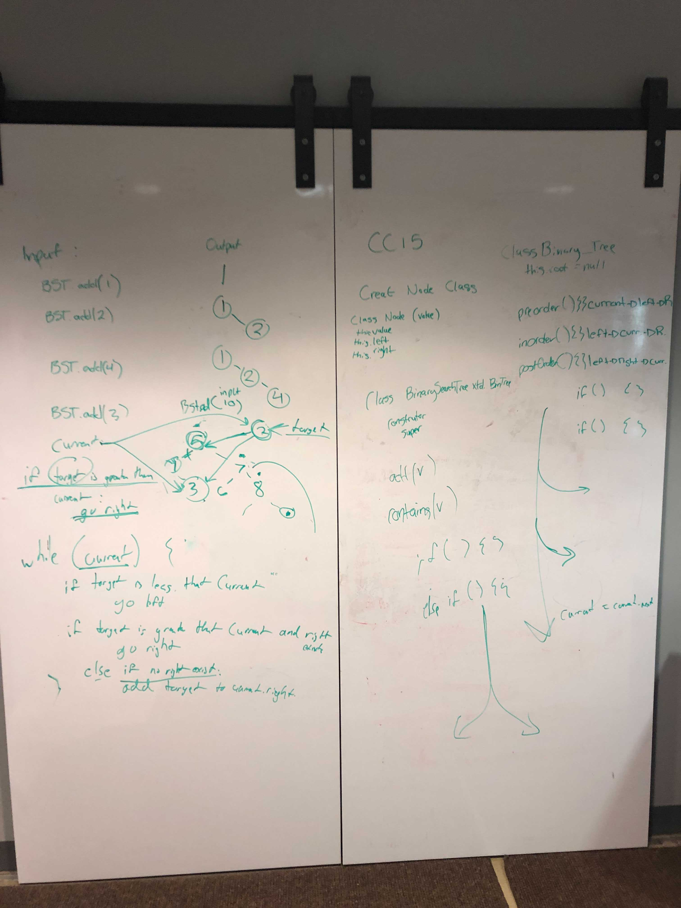

# Trees

## Challenge
<!-- Description of the challenge -->
### Node

    Create a Node class that has properties for the value stored in the node, the left child node, and the right child node.

### Binary Tree

    Create a Binary Tree class
        Define a method for each of the depth first traversals:
            pre order
            in order
            post order
        Each depth first traversal method should return an array of values, ordered appropriately.

### Binary Search Tree

    Create a Binary Search Tree class
        This class should be a sub-class (or your languages equivalent) of the Binary Tree Class, with the following additional methods:
        Add
            Arguments: value
            Return: nothing
            Adds a new node with that value in the correct location in the binary search tree.
        Contains
            Argument: value
            Returns: boolean indicating whether or not the value is in the tree at least once.

## Testing

[x]    Can successfully instantiate an empty tree.  
[x]    Can successfully instantiate a tree with a single root node.  
[x]    For a Binary Search Tree, can successfully add a left child and right child properly to a node.  
[x]    Can successfully return a collection from a preOrder traversal.  
[x]    Can successfully return a collection from an inOrder traversal.  
[x]    Can successfully return a collection from a postOrder traversal.  
[x]    Returns true/false for the contains method, given an existing or non-existing node value.  

Ensure your tests are passing before you submit your solution

## Approach & Efficiency
<!-- What approach did you take? Why? What is the Big O space/time for this approach? -->
I took a recursive approach to return and go through each of the traversals, which I think is 10 times more easy to understand from the perspective of the outside reader, while not that much less efficient than other approaches, as well as taking into account all that the size of the function only grows with the size of the leafs of the tree

## API
<!-- Description of each method publicly available in each of your trees -->

Add
Arguments: value  
Return: nothing  
Adds a new node with that value in the correct location in the binary search tree.  
Contains  
Argument: value
Returns: boolean indicating whether or not the value is in the tree at least once.
Define a method for each of the depth first traversals:
pre order
in order
post order
Each depth first traversal method should return an array of values, ordered appropriately.
