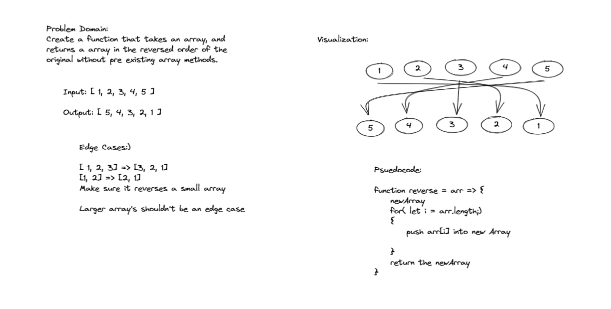

# Reverse an Array
<!-- Description of the challenge -->
My task is to take in array, and without using pre-existing prototype functions creating a function that returns a reversed array

## Whiteboard Process
<!-- Embedded whiteboard image -->

## Approach & Efficiency
<!-- What approach did you take? Discuss Why. What is the Big O space/time for this approach? -->

I took the path of least resistant, I think creating a new array and returning that is much simple then returning the original array that has been edited.
