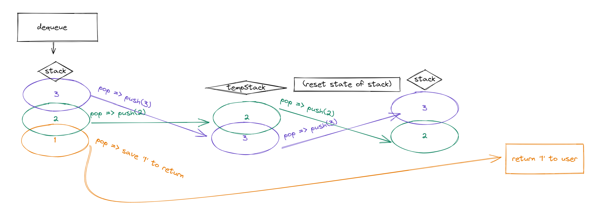

# Stack Queue Pseudo

## Challenge

Implement a pseudo-queue class that utilized two Stack class objects and Stack class methods to do First In First Out enqueues and dequeues.

## Approach & Efficiency

I'm going to implement two Stacks in the constructor of the pseudo-queue and shuffle nodes from one Stack to the other Stack to do dequeues. Enqueues should be as simple as implementing the class function push.

As far as efficiency goes, this takes a long time to do and for time I am pretty sure that this is a O(n^3). Or something like that, idk

## Whiteboard

